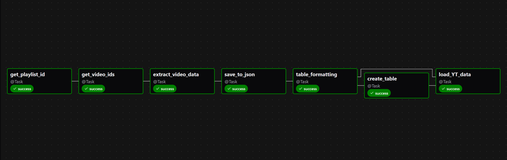
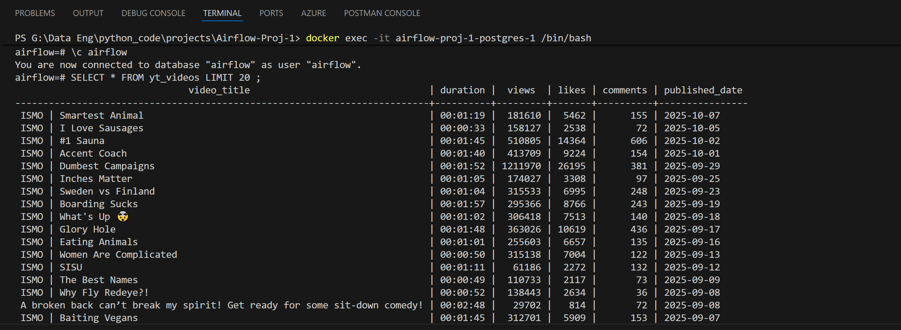

# YouTube Data Pipeline

A data engineering project that extracts video metadata from YouTube channels using the YouTube Data API and loads it into PostgreSQL through an automated ETL pipeline orchestrated with Apache Airflow.

## Overview

This project demonstrates a complete data pipeline workflow that:
- Extracts video data from YouTube channels via the YouTube Data API
- Transforms the data using Python and Pandas
- Loads the processed data into a PostgreSQL database
- Orchestrates the entire workflow using Apache Airflow running in Docker containers

## Architecture

```
YouTube API → Python Script → JSON File → Pandas Transformation → CSV File → PostgreSQL Database
                                    ↑
                          Orchestrated by Airflow (Docker)
```
## Tech Stack

* **Orchestration**: Apache Airflow
* **Containerization**: Docker & Docker Compose
* **Language**: Python, SQL
* **Data Processing**: Pandas
* **Database**: PostgreSQL
* **API**: Google API Client (for YouTube Data API v3)

## Features

### Data Extraction
- Connects to YouTube Data API to fetch video metadata
- Extracts key metrics including:
  - Video title
  - Duration
  - Number of likes, Views, comments, and Published date
- Saves raw data to JSON format

### Data Transformation
- Loads JSON data into Pandas DataFrames
- Performs data cleaning operations:
  - Column reordering for better structure
  - Removal of unnecessary columns
  - Duration format conversion
- Exports transformed data to CSV format

### Data Loading
- Creates PostgreSQL table
- Loads CSV data into the database

## Prerequisites

- Docker and Docker Compose installed
- YouTube Data API key
- Python 3.11
- airflow 3.0.0
- Basic understanding of SQL and data pipelines

## Setup Instructions

### 1. Clone the Repository
```bash
git clone https://github.com/amirfirouzi87/Airflow-Proj1-YT-Data-Pipeline.git
cd Airflow-Proj1-YT-Data-Pipeline
```

### 2. Configure YouTube API Key
Create a `.env` file in the project root:
```
API_KEY=
CHANNEL_HANDLE=
AIRFLOW_UID="50000"
POSTGRES_CONN_USERNAME=
POSTGRES_CONN_PASSWORD=
```

### 3. Start Airflow with Docker Compose
```bash
docker-compose up -d
```

This will start all required Airflow services including:
- Airflow Webserver
- Airflow Scheduler
- PostgreSQL Database


### 4. Access Airflow UI
Open your browser and navigate to:
```
http://localhost:8080
```

Default credentials:
- Username: `airflow`
- Password: `airflow`

### 5. Run the Pipeline
- Navigate to the DAGs page in the Airflow UI
- Enable the YouTube data pipeline DAG
- Trigger the DAG manually or wait for the scheduled run


## Project Structure

```
Airflow-Proj1-YT-Data-Pipeline/
│
├── dags/
│   ├── api/      
│   │    └── yt-etl.py              # PostgreSQL loading script 
│   ├── load.py                     # Create table and load data into it
│   ├── transform.py                # Making changes to JSON file and save as CSV
│   └── yt-etl.py                   # DAG script
│
├── logs/                           # Airflow DAG execution logs
│
├── data/                           # JSON & CSV files will be stored here 
│
├── docker-compose.yml              # Airflow Docker Compose configuration
├── .env                            # Environment variables (API keys)
└── README.md                       # Project documentation
```

## Pipeline Workflow

1. **Extract**: Python script calls YouTube Data API and saves response to `json` file
2. **Transform**: Pandas reads JSON, applies transformations, exports to `csv` file
3. **Load**: Script creates table in PostgreSQL and loads CSV data
4. **Orchestrate**: Airflow manages task dependencies


## Expected Result







## Lessons Learned

This project provided hands-on experience with:
- Building end-to-end data pipelines
- Working with REST APIs
- Container orchestration with Docker
- Workflow management with Airflow

## Contributing

Feel free to fork this repository and submit pull requests. 
